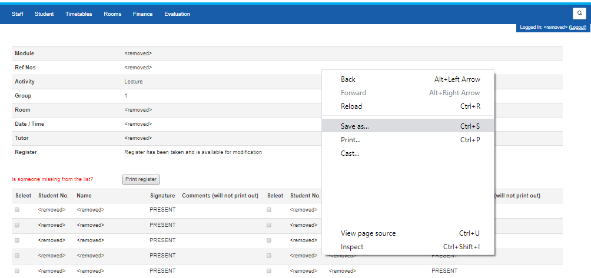

# parsereg

parsereg is a tool to parse registers saved from [eVision](https://www.tribalgroup.com/software-and-services/student-information-systems/sitsvision) and outputs the attendance information as a spreadsheet.

## Installation and use

parsereg requires at least version 7 of the [Java Runtime Environment](https://www.java.com/en/download/).

 * [Save all of the registers into a directory](#saving-registers)
 * Download the .jar file from the [releases page](https://github.com/ccawley2011/parsereg/releases) and run it.
 * Click the "Open" button and select the directory containing the registers you want to parse.
 * Click the "Save" button and select where you want to save the spreadsheet.
 * Open the created spreadsheet using Microsoft Excel or another spreadsheet program.
 
## Saving Registers

Completed registers can be downloaded from eVision in .html format by navigating to the page, right-clicking, and selecting `Save As...`

It is possible to use parsereg to process multiple registers across multiple modules similtaneously; simply download all required registers within the same directory and parsereg will automatically separate attendance based on module. 
